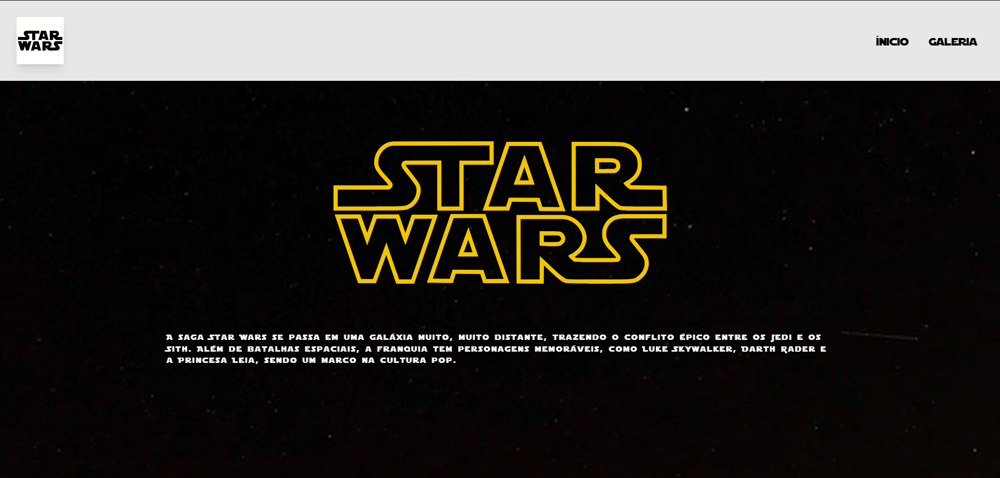
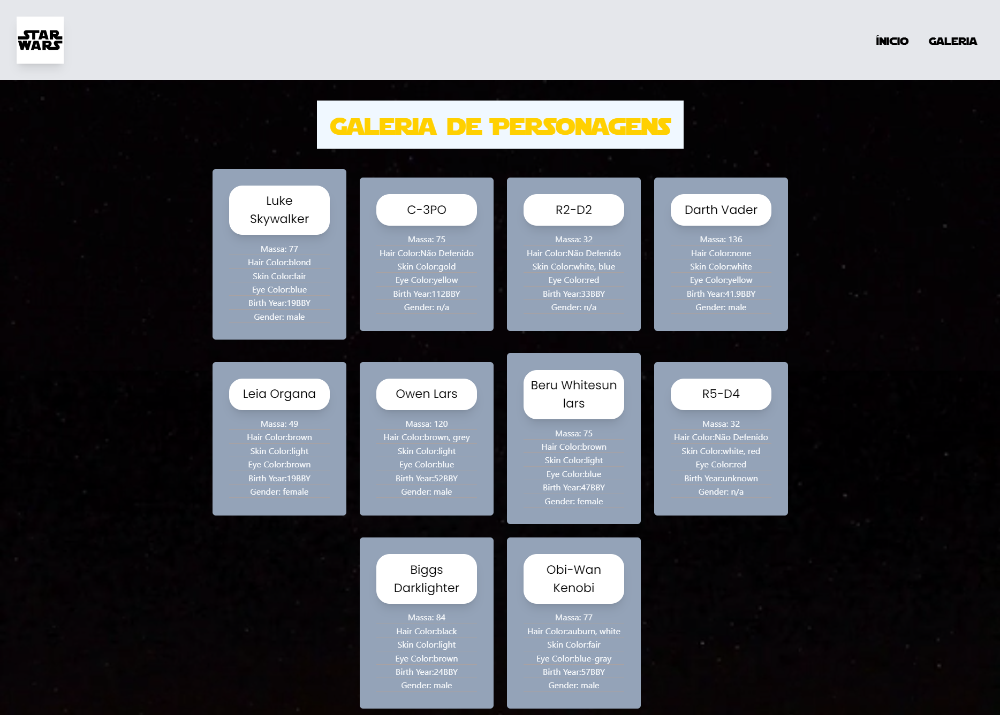
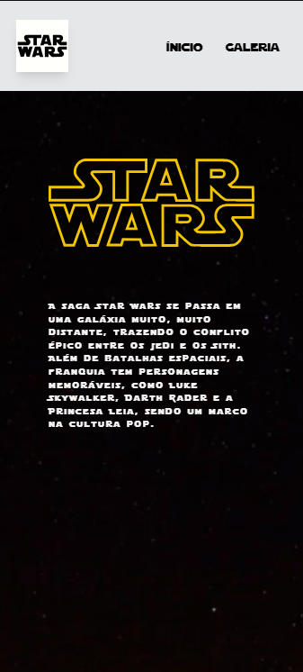
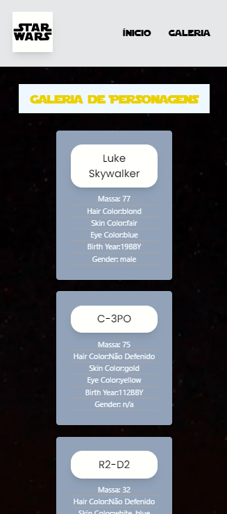

# Fabrica de Software - Desafio Front-End

- ℹ️ Deploy url: https://starwarsapi-workshop.netlify.app

## Tecnologias Usadas ⚛️

- React(Components,UseState,UseEffect)
- Javascript
- CSS (TailwinsCSS e CSS Puro)
- HTML

### Desktop Preview

### Mobile Preview

# React + Vite

This template provides a minimal setup to get React working in Vite with HMR and some ESLint rules.

Currently, two official plugins are available:

- [@vitejs/plugin-react](https://github.com/vitejs/vite-plugin-react/blob/main/packages/plugin-react/README.md) uses [Babel](https://babeljs.io/) for Fast Refresh
- [@vitejs/plugin-react-swc](https://github.com/vitejs/vite-plugin-react-swc) uses [SWC](https://swc.rs/) for Fast Refresh
